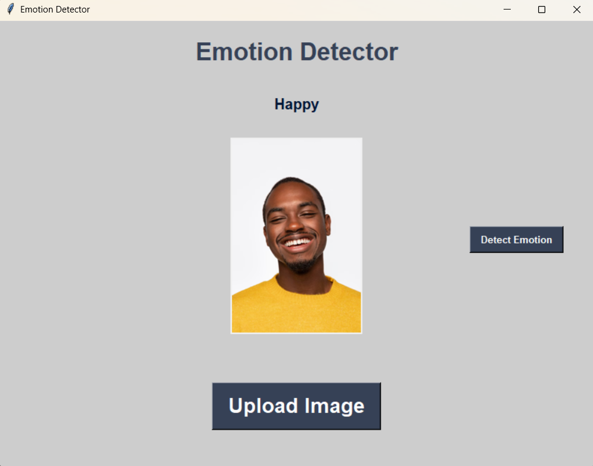

# Emotion Detection

A simple yet effective emotion detection model using Machine Learning and Computer Vision techniques. This project leverages the **FER-2013 dataset** to classify facial expressions into various emotional categories.

## Project Overview

This repository contains a facial emotion detection system built using **TensorFlow**, **OpenCV**, and **Keras**, implemented initially in **Anaconda** using **Jupyter Notebook**, and later trained and optimized using **Kaggle Notebooks** for better GPU acceleration.

The model detects emotions such as *happy, sad, angry, surprise,* etc., from facial images, and a simple GUI is provided for user interaction.

---

## Features

* Emotion classification using a Convolutional Neural Network (CNN)
* Trained on the FER-2013 dataset
* User-friendly GUI for image-based emotion detection
* Portable and easy to run

---

## Technologies Used

* Python 3.x
* TensorFlow
* Keras
* OpenCV (`cv2`)
* NumPy
* Tkinter (for GUI)
* Jupyter Notebook (development environment)
* Anaconda (local environment setup)
* Kaggle (GPU-based model training)

---

## Dataset

The model is trained on the **FER-2013 (Facial Expression Recognition)** dataset, which contains over 35,000 labeled grayscale images of faces expressing 7 different emotions. This dataset is available in [Kaggle Datasets](https://www.kaggle.com/datasets/msambare/fer2013).

---

## Installation & Usage Instructions

### Prerequisites

Make sure you have Python 3.x installed. It’s recommended to use **Anaconda** for managing dependencies.

### Clone the Repository

```bash
git clone https://github.com/your-username/Emotion_Detection.git
cd Emotion_Detection
```

### Install Dependencies

You can install the required Python packages using `pip`:

```bash
pip install tensorflow opencv-python
```

Or, if you are using Anaconda:

```bash
conda install tensorflow opencv
```

### Run the Application

1. Open a terminal or Anaconda Prompt
2. Navigate to the project directory
3. Run the GUI:

```bash
python gui.py
```

4. Upload an image with a face using the GUI
5. Click the **"Detect"** button to classify the emotion

---

## Model Training (Optional)

If you want to train or fine-tune the model:

* Use `emotion_detection.ipynb` in a Jupyter Notebook environment.
* The training was conducted on **Kaggle** to utilize GPU acceleration.
* Modify and upload the notebook to your Kaggle account to retrain or test the model.

---

## GUI Demo

 <!-- Replace this with your actual image path -->

---

## Contributing
Contributions are welcome! Please fork the repository and submit a pull request for any improvements or feature additions.

